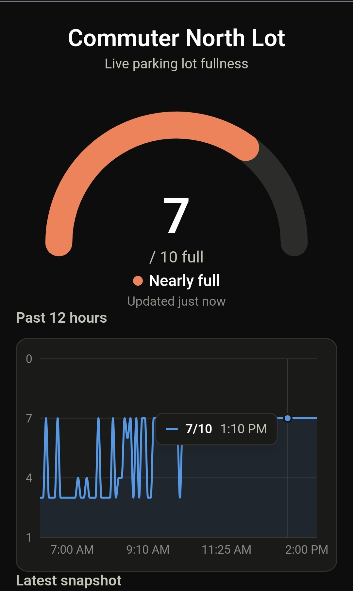

# Hi, I'm Graysen Gould 👋

Computer Science student at Texas Tech University, working across reinforcement learning, HPC/parallel computing, and full-stack dashboards.

---

### 🧭 About Me

- 🎓 Studying Computer Science at Texas Tech University
- 🔬 Researching CIP methodologies for Reinforcement Learning policies at the **CI2 Lab**
- ⚙️ Past work spans distributed computing (OpenSHMEM), DevOps tooling at **NVIDIA**, and deployment tooling at **Tyler Technologies**
- 🌱 Currently interested in RL, systems programming, and developer tooling
- 💞️ Open to collaborating on interesting Python / systems projects

---

### 🚀 Featured Work

<table>
<tr>
<td width="50%" valign="top">

**🅿️ Tech Parking Sucks**

A live dashboard that tracks how full campus parking lots are, so students can decide whether to drive or take the bus before they waste the trip.

[techparkingsucks.com →](https://techparkingsucks.com)

</td>
<td width="50%" valign="top">

</td>
</tr>
<tr>
<td width="50%" valign="top">

**🤖 CartPole — Double DQN Agent**

Built a Double DQN reinforcement learning agent from scratch to solve the classic CartPole balancing problem.

</td>
<td width="50%" valign="top">

</td>
</tr>
</table>

**📡 OpenSHMEM Implementations**
- Implemented new features for the **OpenSHMEM 1.6** specification
- Integrated **UCC** (Unified Collective Communication) into **OSSS-UCX**

---

### 💼 Experience

| | |
|---|---|
| **CI2 Lab** — Texas Tech University | Extending CIP methodologies for Reinforcement Learning policies |
| **NVIDIA** — DevOps Engineering Intern | Built a data-syncing tool for CI/CD operations |
| **DISCL** — Texas Tech University | Implemented new features for the OpenSHMEM 1.6 specification |
| **Tyler Technologies** | Built a production deployment dashboard to catch issues in bi-weekly deployments |

---

### 📊 GitHub Stats

---

📫 Reach out on [LinkedIn](https://www.linkedin.com/in/graysengould/) · 🐦 [Twitter/X](https://x.com/RealGraysenG) · 🌐 [graysengould.com](https://graysengould.com/)

